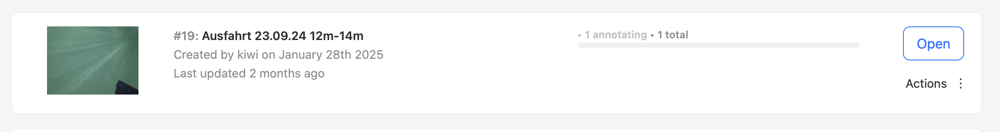

# baltic-seagrass

A project to train, evaluate and run vision models to detect seagrass in images and video frames.
The code for this project has been developed through a collaborative effort between WWF, [KI-Ideenwerkstatt](https://www.ki-ideenwerkstatt.de) and [Birds on Mars](https://birdsonmars.com).

> This repository partially uses provided code and models from the [bag of seagrass](https://github.com/sgraine/bag-of-seagrass) project.

## Setup

To get started, let's create a Conda environment, and install dependencies into this environment.

1. Create a new Conda environment:
    ```bash
    $ conda env create --file environment.yml
    ```
2. Activate the new environment!
    ```bash
    $ conda activate baltic-seagrass
    ```
3. Install the project dependencies into the newly created Conda environment.
    ```bash
    $ make install
    ```
4. Quick check whether everything has been installed as expected. Following will trigger the unit test execution:
    ```bash
    $ make test
    ```

## Quickstart
### Training
Run:
```
baltic_seagrass train-quickstart
```
This will start a quickstart of a training run with 20 epochs as defined in the [corresponding resnet18 config file](./baltic_seagrass/config/resnet18.yml) on the dataset you provide in the `dataset` fields of the [base.yml](./baltic_seagrass/config/base.yml). At the End of the run a fiftyone server is started highlighting the results of the evaluation on the testset. Checkpoints are written to `data/model_checkpoints` directory.

### Standalone evaluation
Before you can run the following, you need to have a checkpoint from a previous training run.

```
baltic_seagrass evaluation-example --checkpoint <path-to-your-checkpoint>
```

This will execute an evaluation run of the desired checkpoint on evaluation data specified in [base.yml](./baltic_seagrass/config/base.yml). At the End of the run a fiftyone server is started highlighting the results on each image.

### Inference
### Classifier Inference using trained model
Run:
```
baltic_seagrass inference-on-video-example
```
For argument details run `baltic_seagrass inference-on-video-example --help`.

This will execute an inference run on a video defined via `--video-file`. After the run a fiftyone server is started, highlighting the classified images.

### Bag of Seagrass Inference
Run:
```
baltic_seagrass bag-of-seagrass-example
```
This will create a `data/patched` directory and run the bag of seagrass inference on 4 frames loaded from the videos referenced in [base.yml](./baltic_seagrass/config/base.yml). After the execution, a fiftyone server is started where you can inspect the results in your browser.

## Repository Structure

The repository is organized into the following key directories and scripts under the `baltic_seagrass/` folder:

### `baltic_seagrass/`
This is the main directory containing the productive code and key scripts for the project.

- **`core/`**: Contains the core logic and essential code for the project.
    - **`models/`**: Contains scripts for each model class. Currently, three models are implemented:
        - **`BinaryResnet18`**: A basic implementation of a PyTorch ResNet18 model with a binary output layer, trained using BinaryCrossEntropy loss.
        - **`BagOfSeagrass`**: Includes three separate models: SeaCLIP, SeaFeats, and an ensemble of both. These models can output a four-class result (background and three types of seagrass) or a binary classification.
    - **`datasets/`**: Contains scripts for building a PyTorch `Dataset` object from images and labels (processed using `datumaru_processor.py` and `video_processor.py`).
    - **`config_loader.py`**: Loads and processes the YAML configuration files.
    - **`data_loader.py`**: Constructs a PyTorch `DataLoader` object given a `Dataset` object (with training and test splits).
    - **`evaluator.py`**: Evaluates a model on a test `DataLoader` and computes metrics such as accuracy and F1 score. It can be used during training every `n` epochs or as a standalone script.
    - **`model_factory.py`**: Creates instances of the implemented models, and supports saving/loading model checkpoints (for resuming training).
    - **`trainer.py`**: Manages the training of models based on the YAML configuration file, supports model checkpointing, and provides evaluation at specified intervals.
    - **`video_processor.py`**: Processes video files by extracting relevant frames (based on labels) and applying basic transformations.

- **`scripts/`**: Contains scripts for interacting with the core functionality of the repository.
    - **`evaluation_script.py`**: Evaluates a trained model on a dataset (created by `dataloader_script.py`), and generates evaluation metrics.
    - **`training_script.py`**: Trains a model on a given dataset folder and evaluates it periodically.
    - **`inference_patched_script.py`** Runs a bag-of-seagrass inference on a given Dataset and highlights detected classes for each patch of a frame as described in the [bag-of-seagrass](https://github.com/sgraine/bag-of-seagrass) repository.

- **`config/`**: Contains configuration files in YAML format for training, evaluation, and dataset selection.
    - **`base.yml`**: Base configuration shared by all models, containing parameters for evaluation and dataset settings.
    - **`[model_name].yml`**: Model-specific YAML files that handle the training parameters for each model.

### Data Processing Workflow
The data processing pipeline is as follows:
1. **Video and Label Files**: Given a list of video files and an annotations directory containing JSON files (currently in Datumaru format), we construct a dataset by processing the labels (`datumaru_processor.py`) and extracting relevant frames from the video (`video_processor.py`). The video filenames and JSON filenames inside the annotations directory must match. Relevant frames are indicated by a present label inside the corresponding field `annotations` of datumaro format. The categories we defined during the labeling phase are `background` or `seagrass`. If no such label is present in the frame then it is regarded as invalid and is thus skipped.
2. **Dataset and DataLoader Creation**: The `datasets/seagrass.py` and `video_processor.py` scripts are used to create the `Dataset` and `DataLoader` objects that are compatible with PyTorch for training, inference, and evaluation.


## Exporting Datasets from CVAT
1. Go to https://cvat.ki-ideenwerkstatt.de/tasks

2. Click on righthand `Actions` menu of the desired task and click `Export task dataset`. The task should correspond to a videosnippet imported for annotation.


3. Select `Datumaro` export format from dropdown menu and click ok. After some seconds a popup window should show up leading you to a download link

4. Place the exported json file into the `data/annotations` directory and give it the same name as the corresponding video snippet. All videofiles placed inside [video_files field](./baltic_seagrass/config/base.yml) will be taken as source for training runs and thus the annotation jsons must match the names of the corresponding videos.

## Development

### Adding dependencies
Use `poetry` to add new dependencies to the project:
```bash
$ poetry add [package-name]
```


### Running tests
Run all unit and integration tests, and print a coverage report:
```bash
$ make test
```

## FiftyOne Integration

When running the evaluator with the argument `save_fiftyone=True`, the data is saved to a FiftyOne dataset. To view the dataset in the FiftyOne web UI, execute the `fiftyone_logger.py` script.

If you are working on the KI-IW remote machine, you may need to manually forward port `5154` to your local machine. Once the port is forwarded, you can access the FiftyOne web interface by navigating to [http://localhost:5154/](http://localhost:5154/) in your browser.
